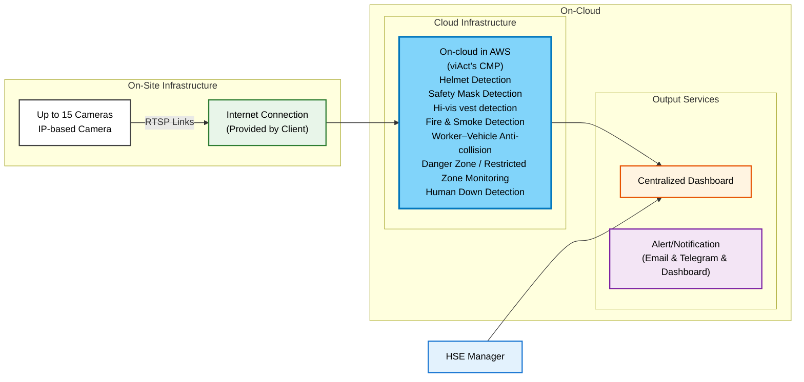

# System Architecture: Video Analytics Solution Proposal for Bromma Malaysia

**Client:** Bromma Malaysia

**Deployment Method:** CLOUD

**Cameras:** 15

**AI Modules:** 7

---

## Architecture Diagram

